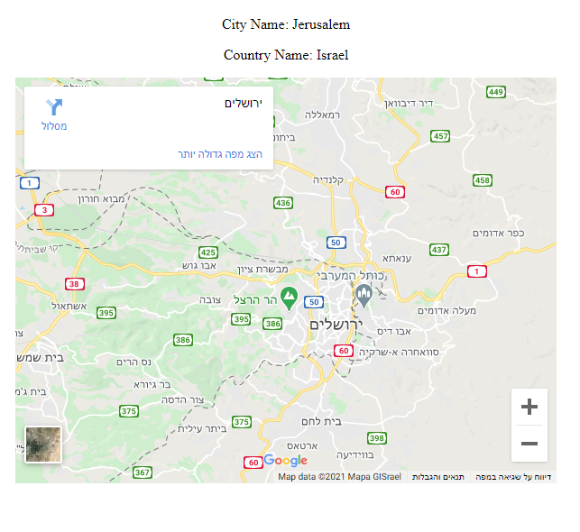

React - Google Maps

This is a simple react application, 
It queries the user's location and shows it on the map!
In addition, the application shows the city and country names.

technologies used: react, axios, IPdata API, google maps embed API

an image of the application:
